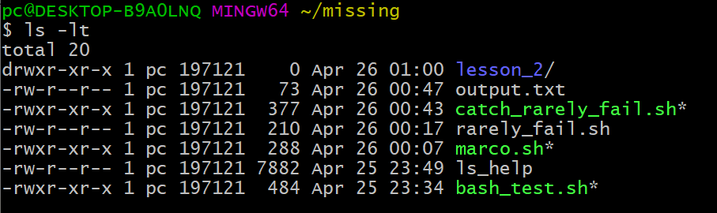

- [Course page](#course-page)
- [1](#1)
- [2](#2)
- [3](#3)
- [4](#4)
- [5](#5)

## Course page  
https://missing.csail.mit.edu/2020/shell-tools/  

## 1  
```shell
ls -alht --color=auto
```
  

## 2
```shell
#! /usr/bin/env python

SAVE_PATH="/tmp/marco_path"

marco () {
    cur_path=$(realpath .)
    echo  $cur_path > $SAVE_PATH
    echo "save $cur_path as marco path!"
}

polo () {
    marco_path=$(cat $SAVE_PATH)
    echo "polo! let's go to the marco path"
    cd $marco_path
}
```
## 3  
```shell
#! /usr/bin/env bash

cnt=1

DEFAULT="\e[1m"
RED="\e[32m"
GREEN="\e[33m"
YELLOW="\e[34m"

while :
do
    let cnt++
    bash rarely_fail.sh
    if [[ $? -eq 1 ]]; then
        echo -e "${GREEN}Run for $cnt time, everything went ok${DEFAULT}"
    else
        echo -e "${RED}Something went wrong${DEFAULT}"
        break
    fi
done

echo -e "${YELLOW}Total run: $cnt${DEFAULT}"
```
```shell
bash catch_rarely_fail.sh | tee output.txt
```
  

## 4  
```shell
find . -name "*.html" | xargs --delimiter='\n' tar -czvf html.tar.gz
```
  

## 5  
```shell
ls -lt
```
  
